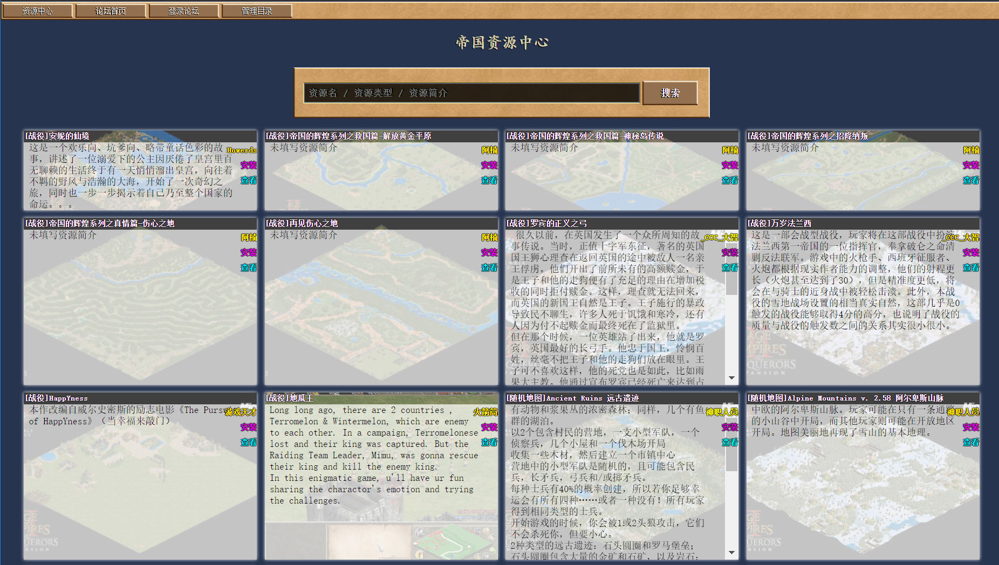

# 翔鹰帝国资源中心


## 项目简介

本项目是
[帝国时代Ⅱ帝王版](http://www.hawkaoe.net/bbs/thread-117563-1-1.html)
的一部分

> 帝国时代Ⅱ帝王版
> 全球首个四合一版本帝国（1.4、1.0C、被遗忘的帝国、1.0A）。
> 配置最好用的管家，帮您轻松一键管理帝国，省去打开文件夹、找文件等各种麻烦，超好用，超便利！
> 联网更新，再也不用担心版本冲突。
> 内置创意工坊，一键下载安装翔鹰论坛的战役、场景、随机地图、人工智能、模组和录像等资源，你想要什么，这里就有什么。

本项目主要负责其中的游戏资源管理（资源上传、存储、检索、压缩、传输），并提供后台管理界面：

[帝国资源中心 https://ssrc.snomiao.com/ssrc/](http://ssrc.snomiao.com/ssrc/)

效果图： 

## 如何搭建测试环境？
欢迎广大玩家自建服务器测试 =. =

1. 环境
	搭建 lnmp 或者 wnmp，教程百(gu)度(ge)
2. 设置
	复制 config/ 文件夹，命名为 user-config/
	然后在 user-config/ 里配置你的个人服务器
	按以下模板填入你的SSRC数据库和Discuz论坛数据库账号，测试通过即可完成部署。
	```php
	<?php
	// SSRC数据库 读写权限
	define('DB_NAME'    , '//');
	define('DB_CHARSET' , '//');
	define('DB_HOST'    , '//');
	define('DB_USERNAME', '//');
	define('DB_PASSWORD', '//');

	// Discuz 论坛，只读权限
	define('BBS_DB_NAME'    , '//');
	define('BBS_DB_CHARSET' , '//');
	define('BBS_DB_HOST'    , '//');
	define('BBS_DB_USERNAME', '//');
	define('BBS_DB_PASSWORD', '//');
	```
3. OK

遇到问题？请骚扰雪星(QQ: 997596439)。

## 参见：

项目介绍：
- [帝国时代Ⅱ帝王版](http://www.hawkaoe.net/bbs/thread-117563-1-1.html)

资源中心：
- [帝国资源中心：https://ssrc.snomiao.com/ssrc/](http://ssrc.snomiao.com/ssrc/)

源码：
- [帝国时代管家源码：https://github.com/sdjnyty/AocManagerTool](https://github.com/sdjnyty/AocManagerTool)
- [帝国资源中心源码：https://github.com/snomiao/ssrc-server](https://github.com/snomiao/ssrc-server)（本项目）
- [帝国资源中心接口文档](./PortDocument.md)
- [帝国资源中心数据库设计](./帝国资源中心数据库.sql)
- [帝国资源中心浏览方式定义](./浏览方式定义.md)